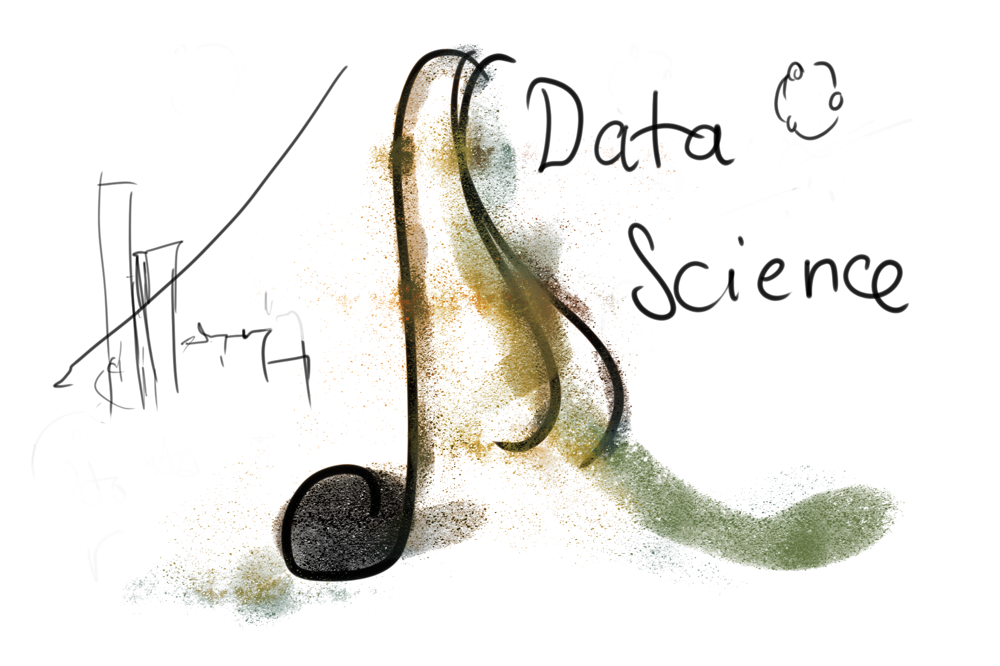

<head>
  <title>Khoa Học Dữ Liệu Là Một Điệu Nhạc | Khoahocdulieu.org</title>
  <meta
    name="description"
    content="Nét đẹp tinh tế của Khoa học Dữ liệu"
  />
  
</head>

<intro-end />

Khoa Học Dữ Liệu là một điệu nhạc. Một điệu nhạc rất đẹp, quyến rũ, đầy lôi cuốn và say mê. 

"Đẹp tuyệt. Em có thể cảm nhận được dòng chảy của thời gian trong nó" 
Olivia ngả đầu vào vai Matt, hai người đang ngắm bức tranh mới được mua về.

Sau ngần ấy thời gian sống với nhau, Matt vẫn không thể nào hiểu nổi cái đẹp trong mắt của cô.

Những đường kẻ loằn ngoằn trên trang giấy trắng.

---

Đó chỉ là một trong vô số trường hợp sự khác biệt trong quan điểm của chúng ta, 
mà đứng trên góc độ một người học  dữ liệu có thể giải thích rằng, bởi vì nguồn dữ liệu mà chúng ta "học" được là khác nhau, 
và thậm chí trong quá trình "thu thập" và "tiền xử lý" dữ liệu ấy, 
dữ liệu đã bị sai lệch giữa người với người vì biểu hiện gen của chúng ta là khác nhau, 
dù cơ thể người chỉ có hơn 20.000 gen [1]. 
Làm thế nào một người học khoa học dữ liệu lại biết những thứ không liên quan gì như biểu hiện gen, số lượng gen? 
Bởi vì ta cố gắng học từ Tạo Hóa: tự nhiên, các quy luật, toán học, con người,.... 
Và ta luôn được tiếp xúc với nhiều tập dữ liệu khác nhau của các ngành khác nhau, 
thứ mà đòi hỏi các kiến thức khác nhau, điều đó thúc đẩy một niềm đam mê học hỏi vô cùng lớn trong 
mỗi người học khoa học dữ liệu, một khát khao được khám phá thế giới rộng lớn đầy những "hạt bụi vàng".

*"Mỗi phút, mỗi lời tình cờ được nói ra và mỗi cái nhìn vô tình ta bắt gặp, 
mỗi ý nghĩ sâu sắc hoặc bông đùa, mỗi rung động thầm lặng của con tim, 
thậm chí một bông tiêu huyền xốp đang bay lượn, hay lửa sao trong một vũng nước đêm - 
tất cả những cái đó đều là những hạt rất nhỏ của bụi vàng."*

Bụi Quý - Konstantin Paustovsky

---

Đoạn trên là đoạn mở đầu, nhưng có lẽ chừng ấy cũng đủ cho bài viết này, 
vì nó đã bao hàm đủ các ý mà tôi muốn thể hiện: những hạt bụi vàng, 
KHDL mọi lúc trong cuộc sống, và sự tiếp xúc với mọi ngành, luôn luôn học được tri thức mới. 
Và đã được thể hiện một cách khách quan nhất có thể, khi bỏ đi chủ ngữ là con người cụ thể, 
cố gắng tập trung vào cốt lõi là câu chuyện thay vì cá nhân. 
Tuy nhiên, niềm ham muốn được đưa bản thân mình vào trong những câu chuyện thú vị thực khó kiềm chế.

---

Kể từ lúc bắt đầu tiếp xúc với Khoa học dữ liệu, 
tôi nhận ra mỗi một phút giây trong cuộc đời mình đều có thể cụ thể ra một quá trình trong KHDL. 
Ấy cũng có thể là một hiện tượng của "bệnh nghề nghiệp", như là những ngày cặm cụi học vẽ, 
9h tối khi bước ra khỏi phòng học, sau gần 3 tiếng miệt mài với màu sắc, mọi thứ xung quanh đều trở nên khác lạ, 
bằng một cách nào đó, mắt đã điều chỉnh để trong ánh nhìn, 
mọi vật đều tuyệt đẹp, đều có thể trở thành một phần trong một bức tranh vẽ, 
với value và độ bão hòa rõ ràng, quán cà phê đầu hẻm trở nên thơ lạ kỳ, ngay cả con đường nhựa dưới ánh đèn vàng, 
hay những tán cây hắt sáng trong đêm khi xe buýt vụt qua cũng đều trở nên cuốn hút lấy người thợ vẽ, 
đưa cho anh ta cảm xúc, không kịp chờ đợi để mà bắt tay ngay vào dùng những chất liệu đang trôi qua ấy, 
cố gắng bắt lấy nó trước khi các giác quan trở lại tầm thường. Hay những hôm đi học tiếng anh giao tiếp, 
khi bước về dọc đường, những âm thanh nói chuyện đó đây vào tai tôi đều nghe như anh ngữ cả. 
Giờ đây, tôi có thể gọi đó là Sự lệch dữ liệu.

(cont)
Tham khảo

[1]. https://web.ornl.gov/sci/techresources/Human_Genome/project/hgp.shtml