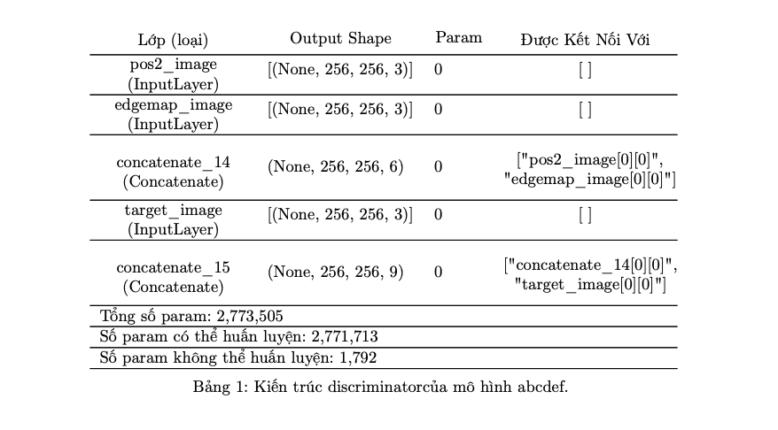

<head>
  <title>Bí kíp LaTeX - Sự hỗ trợ của các công cụ và lệnh LaTeX thường dùng | Khoahocdulieu.org</title>
  <meta
    name="description"
    content="Cùng tìm kiểu cách sử dụng LaTeX nhanh chóng, hiệu quả như một công cụ đắc lực thay vì rối não giữa các dòng lệnh"
  />
  <style>{`
    :root {
      --doc-item-container-width: 60rem;
    }
  `}</style>
</head>

<intro-end />


Các bạn đọc thân mến,

Khi viết báo cáo nghiên cứu, LaTeX là ngôn ngữ lập trình chúng ta thường sử dụng để viết, vì LaTeX giúp ta có một file pdf đẹp mắt, chuẩn format. Trong các khoá học tại Khoahocdulieu.org, các bạn sẽ thấy chúng tôi sử dụng LaTeX trong text cell Colab để viết công thức toán.

Khi mới bắt đầu sử dụng LaTeX, việc nhớ các cú pháp trong LaTeX để sử dụng không dễ dàng, và dễ gây tốn thời gian, hay phân tâm trong khi bạn cần tập trung vào nội dung viết. Dưới đây tôi chia sẻ một số công cụ và lệnh tôi sử dụng để tiết kiệm thời gian khi viết bằng LaTeX và vẫn có một file pdf đẹp.

## Công cụ hỗ trợ

http://detexify.kirelabs.org/classify.html : Tôi hay xài cái này nhất, mình vẽ ký hiệu và công cụ sẽ xác định các lệnh tương ứng cho mình.

https://mathpix.com : Phần mềm sử dụng OCR, có phần mềm này xài LaTeX nhẹ nhàng hơn. Dùng nó chụp ảnh màn hình hoặc chụp bằng camera, nó sẽ chuyển ảnh này sang code LaTeX. Tôi hay dùng khi cần gõ lại đề bài, chép công thức từ paper, thấy người khác dùng để chuyển từ viết tay thành LaTeX nữa. Nếu bạn có mail sinh viên (đuôi edu) thì 1 tháng được 100 lần chụp, tôi chưa bao giờ xài hết số lượng này.

https://www.cmor-faculty.rice.edu/~heinken/latex/symbols.pdf và http://www.malinc.se/math/latex/basiccodeen.php và https://wch.github.io/latexsheet/ : LaTeX cheat sheet.

## Một vài lệnh LaTeX tôi hay xài

### Chèn và căn chỉnh hình ảnh bằng LaTeX

Chèn ảnh tôi hay dùng \textwidth kết hợp với keepaspectratio, nếu ảnh lớn không vừa thì thêm số tỉ lệ trước \textwidth:

```LaTeX
\begin{figure}[h]
   \centering
   \includegraphics[width=0.9\textwidth,keepaspectratio]{images/hello.png}
   \caption{Hello everyone.}
   \label{hello_figure}
\end{figure}
```

### Chèn và căn chỉnh công thức bằng LaTeX

Công thức ngoài equation tôi hay dùng gather và aligned:

```LaTeX
\begin{gather} 
   1 + 1 = 2 \\
   1 + 2 = 3
\end{gather} 
```

và 

```LaTeX
\begin{aligned} 
   1 + 1 &= 2\\
   1 + 2 &= 3 
\end{aligned}
```

### Chèn và căn chỉnh bảng bằng LaTeX

Bảng tôi dùng longtable, \makecell, \multicolumn

Một ví dụ:

Import:

```LaTeX
\usepackage{multirow}
\usepackage{longtable}
\usepackage{makecell}
\usepackage{booktabs}
\usepackage{placeins}
% font tiếng Việt cho ví dụ
\usepackage[vietnamese]{babel}
```

Code:

```LaTeX
\begin{center}
    \begin{longtable}{  m{9em}  m{9em} m{3em} m{10em}  }
      \addlinespace
      \caption{Kiến trúc discriminator\\của mô hình abcdef.}
      \label{discriminator_table}
      \endlastfoot
      %\hline
      \thead{{\normalsize Lớp (loại)}} & \thead{{\normalsize Output Shape}} & \thead{{\normalsize Param}} & \thead{{\normalsize Được Kết Nối Với}}\\ 
      \endfirsthead
      \hline
        \makecell[c]{pos2\_image\\(InputLayer)} & [(None, 256, 256, 3)] & 0 & \makecell[c]{[ ]} \\
      \hline  
      \makecell[c]{edgemap\_image\\(InputLayer)} & [(None, 256, 256, 3)] & 0 & \makecell[c]{[ ]} \\
      \hline
      \makecell[c]{concatenate\_14\\(Concatenate)} & (None, 256, 256, 6) & 0 & \makecell[c]{["pos2\_image[0][0]",\\"edgemap\_image[0][0]"]} \\
      \hline
      \makecell[c]{target\_image\\(InputLayer)} & [(None, 256, 256, 3)] & 0 & \makecell[c]{[ ]} \\
      \hline
      \makecell[c]{concatenate\_15\\(Concatenate)} & (None, 256, 256, 9) & 0 & \makecell[c]{["concatenate\_14[0][0]",\\"target\_image[0][0]"]} \\
      
      \hline
      \multicolumn{3}{l}{Tổng số param: 2,773,505}\\
      \hline
      \multicolumn{3}{l}{Số param có thể huấn luyện: 2,771,713}\\
      \hline
      \multicolumn{3}{l}{Số param không thể huấn luyện: 1,792}\\
      \hline
    \end{longtable}
\end{center}
```

Kết quả:



Nếu bạn thích bảng có kẻ cột có thể thêm | vào lệnh: 

```LaTeX
\begin{longtable}{ m{9em} | m{9em} | m{3em} | m{10em} }
```

Hết.