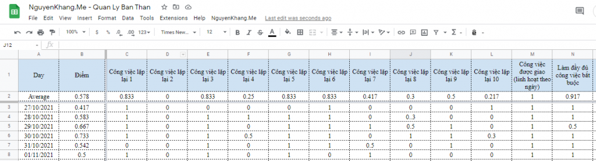
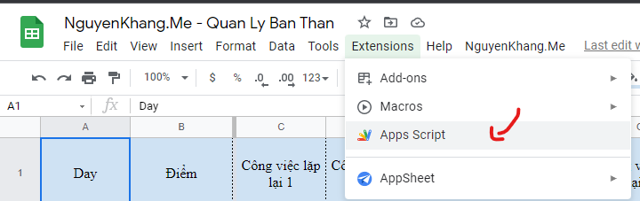
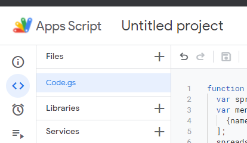
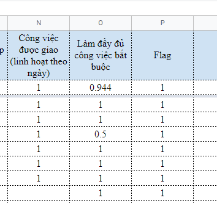
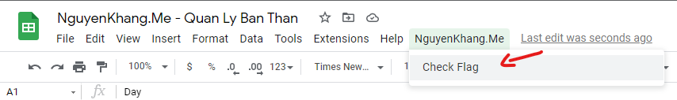

<head>
  <title>Viết nhật ký bằng số với hỗ trợ từ Google Sheets và Google Apps Script | Khoahocdulieu.org</title>
  <meta
    name="description"
    content="Sử dụng khoa học dữ liệu và kỹ năng code để hiểu hơn về bản thân"
  />
  <style>{`
    :root {
      --doc-item-container-width: 60rem;
    }
  `}</style>
</head>

<intro-end />


Các bạn đọc thân mến,

Dưới đây là trải nghiệm của bản thân tôi.

Khi học Khoa học dữ liệu, thật tuyệt khi có thể áp dụng kiến thức mình học được vào 
những điều gần gũi nhất, đó chính là bản thân mình. 
Hãy tưởng tượng ta có thể tìm được cách số hoá một số hoạt động của mình, 
từ đó nhận ra sớm những thay đổi bất thường, như một hôm thấy biểu đồ điểm số của mình 
bỗng dưng xuống dốc, để nhận ra sớm mình đang bị stress, 
từ đó ta ngủ sớm một cách có chủ ý, chú ý ăn uống đầy đủ, hay đến gặp bác sĩ,… 
Việc “số hoá” này tôi thực hiện một cách đơn giản, bởi vì tôi không phải một bác sĩ, 
nên các bạn đọc có thể xem bài viết này như một tham khảo cách viết nhật ký bằng số và biểu đồ. 
Tôi xin đăng lại bài gốc tôi viết trên blog cá nhân vào tháng 2 năm 2022, 
và tôi vẫn sử dụng cách này cho đến hiện tại: 
https://nguyenkhang.me/coding/quan-ly-ban-than-voi-ho-tro-tu-google-sheets-va-google-apps-script.html

Bài này tôi nói về ý tưởng (+code) sử dụng Google Sheets, với sự hỗ trợ của 
Google App Scripts để tính điểm việc hoàn thành các “nhiệm vụ” trong mỗi ngày, 
tính trung bình điểm cho từng ngày, trung bình điểm cho từng hoạt động, 
có thể nhìn trực tiếp trên file xem có thời gian nào mình không hoàn thành tốt công việc không,… 
hoặc có thể export file ra để vẽ biểu đồ,…

Bắt đầu tự thiết kế cho bản thân từ hồi cuối tháng 10 tới hiện tại cũng gần 4 tháng, 
tôi nhận ra thêm một vài điểm của bản thân mà trước chưa để ý tới, 
thấy được phần nào cần cải thiện, có thêm động lực làm việc khi mình đạt được các mốc trong ngày, 
và kể cả những chuỗi ngày không điền vào bảng cũng là một insight thú vị để bản thân nhìn lại 
và liên kết với các sự việc trong cuộc sống.

## Cái hay khi xài Google Sheets:

- Dễ mở, dùng máy tính hay điện thoại đều được, có thể ghim trên trình duyệt web để khỏi quên.
- Dễ xài, dùng trên Google Sheets mà, Google lo hết, kể cả bảo mật.
- Tình tùy chỉnh cao.
- Thay vì tự kiểm tra trong đầu thì có thể ghi ra con số cụ thể để nhìn lại, theo dõi. 
Cách chuyển thành con số như thế nào tùy thuộc vào bản thân.
- Nếu mình biết code thì có thể tự chạy code trên data, Google Sheets cũng hỗ trợ một số hàm thống kê.

## Nguyên nhân:

Tôi từng thử vài app quản lý bản thân mà không hiệu quả lắm, 
xong tự ghi ra các công việc mình cần làm trong ngày trên app note để theo dõi cũng không theo được lâu.

Đợt tháng 8-2021 học ở VSOD, càng thấy việc quản lý bản thân quan trọng, 
tất nhiên quản lý bản thân gồm nhiều thứ, tôi thì thích cụ thể hóa những việc nào có thể ra dữ liệu cho dễ nhìn lại.

Sẵn học data science, nên tôi muốn làm cái app gì đó, mà thấy đao to búa lớn quá, 
nên cuối cùng trở về cách đơn giản nhất, quản lý bản thân mình trước, 
thiết kế flat-database phù hợp cho bản thân, rồi có gì thì chạy code trên data luôn, 
mà hồi giờ chỉ nhìn trên google sheets cũng đủ thông tin.

## Ý tưởng:

Bảng mà các hàng bao gồm điểm cho từng hoạt động cần làm trong ngày.

Mỗi hàng là một ngày, mỗi cột là các hoạt động cần làm trong ngày, mỗi ô là điểm cho hoạt động đó, 
thông thường chạy từ 0 đến 1, tùy bản thân đánh giá.

Có 1 cột để tính điểm trong ngày = trung bình điểm, 
do điểm mỗi hoạt động thường trong khoảng [0,1] nên trung bình điểm cũng trong khoảng này.

Có 1 hàng trên cùng (dưới header) để tính trung bình điểm của mỗi hoạt động trên toàn bộ thời gian.

Cột đầu tiên là ngày, sẽ do Google tự động điền khi mình chỉnh sửa trong hàng.

## Bắt tay vô làm

Dựa vào ý tưởng trên, có thể thiết kế một bảng như sau:



Các công việc lặp lại có thể là: đến phòng gym, đọc sách 30 phút, học tiếng Anh 30 phút, đi ngủ vào 21h, …

Công việc được giao thì linh hoạt vào từng ngày, ví dụ: tham gia meeting về môi trường, code xong phần crawl data cho project của bản thân,…

Bạn có thể tùy chỉnh các cột theo ý mình.

**Công thức ô B2: Điểm trung bình của cả bảng**

```excel
= ROUND(AVERAGE(C2:N2),3)
```

Để ý thay vì tính trung bình theo ngày (theo cột B), ta tính theo công việc (theo hàng 2),  vì cột B sẽ có giá trị mặc định là 0 do công thức ô B3 ở dưới.

**Công thức ô C2 (tương tự cho các ô D2,...N2): Điểm trung bình của 1 công việc**

```excel
=ROUND(AVERAGE(C3:C1001),3)
```

Dùng AVERAGE giúp chỉ tính trung bình cho những ô được điền điểm.

**Công thức ô B3 (tương tự cho các ô B4, B5,...): Điểm trung bình của 1 ngày**

```excel
= ROUND(SUM(C3:N3)/12,3)
```

Ở đây dùng SUM thay cho AVERAGE vì những ô nào không điền sẽ được tính là 0 điểm.

Kéo 2 thanh màu xám xuống dưới dòng 2 và bên phải cột B để "Freeze rows" và "Freeze columns".


Cuối cùng, dùng Google Apps Script để tự động điền ngày cho cột đầu tiên:

Chọn Extensions:





file code.gs: 

```js
// NguyenKhang.me
function onOpen() {
  var spreadsheet = SpreadsheetApp.getActive();
  
  var daily = spreadsheet.getSheetByName('Daily');
    for(var i =1; i<=90;i++){
    if(daily.getRange(1,i).getValue() == 'Flag'){
      PropertiesService.getScriptProperties().setProperty('flag', String(i));
      break;
    }
  }
}

function myFunction() {
  return Number(PropertiesService.getScriptProperties().getProperty('flag'));
}

function onEdit(e) {
  
  var range = e.range;
  var spreadSheet = e.source;
  var sheetName = spreadSheet.getActiveSheet().getName();
  var row = range.getRow();  
  
  if(sheetName == 'Daily')
  {
    var myvalue = Number(PropertiesService.getScriptProperties().getProperty('flag'));
    if(row != 1 && spreadSheet.getActiveSheet().getRange(row,myvalue).getValue() != '1'){
      var new_date = new Date();
      spreadSheet.getActiveSheet().getRange(row,1).setValue(new_date).setNumberFormat("dd/MM/yyyy"); 
      spreadSheet.getActiveSheet().getRange(row,myvalue).setValue('1'); 
    }
    
  }
  
}
```

Quay trở lại bảng tính và thêm cột "Flag", mục đích của cột này là khi sửa những dòng đã có thông tin 
thì ngày không bị tự động cập nhật thành ngày hiện tại, giá trị của cột sẽ được tự động điền là 1, 
do đó nên để cột ở ngoài cùng bên phải, để tránh conflict với công thức của ô B3 (điểm trung bình 1 ngày)



Nếu bạn thêm một cột mới, hoặc xóa một cột thì cần F5 để đoạn code tính lại vị trí của cột "Flag". 
Nếu không muốn F5, ta có thể thay đoạn code trên thành:

```js
function onOpen() {
  var spreadsheet = SpreadsheetApp.getActive();
  var menuItems = [
    {name: 'Check Flag', functionName: 'checkFlag_'},
  ];
  spreadsheet.addMenu('NguyenKhang.Me', menuItems);
  
  var daily = spreadsheet.getSheetByName('Daily');
    for(var i =1; i<=90;i++){
    if(daily.getRange(1,i).getValue() == 'Flag'){
      PropertiesService.getScriptProperties().setProperty('flag', String(i));
      break;
    }
  }
}

function checkFlag_() {
  var spreadsheet = SpreadsheetApp.getActive().getSheetByName('Daily');
  spreadsheet.activate();
  for(var i =1; i<=90;i++){
    if(spreadsheet.getRange(1,i).getValue() == 'Flag'){
       PropertiesService.getScriptProperties().setProperty('flag', String(i));
      break;
    }
  }
}

function myFunction() {
  return Number(PropertiesService.getScriptProperties().getProperty('flag'));
}

function onEdit(e) {
  
  var range = e.range;
  var spreadSheet = e.source;
  var sheetName = spreadSheet.getActiveSheet().getName();
  var row = range.getRow();  
  
  if(sheetName == 'Daily')
  {
    var myvalue = Number(PropertiesService.getScriptProperties().getProperty('flag'));
    if(row != 1 && spreadSheet.getActiveSheet().getRange(row,myvalue).getValue() != '1'){
      var new_date = new Date();
      spreadSheet.getActiveSheet().getRange(row,1).setValue(new_date).setNumberFormat("dd/MM/yyyy"); 
      spreadSheet.getActiveSheet().getRange(row,myvalue).setValue('1'); 
    }
    
  }
  
}
```

Đoạn code trên tạo thêm một menu, sau khi thêm/xóa cột, ta có thể chọn "Check Flag" ở trên menu để code tự tính lại 
vị trí cột flag. Tuy nhiên lần đầu chạy chức năng này Google sẽ cảnh báo "Google chưa xác minh ứng dụng này".



Xong!

File Google sheet (File này tôi dùng code v1, chưa có tạo menu): 
https://docs.google.com/spreadsheets/d/1Jn6n7copBZbF6vVuSFlP_Zo-cDEPyM1Lya9GJMyrcHI/edit?usp=sharing
